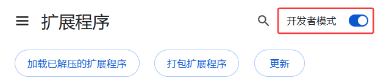
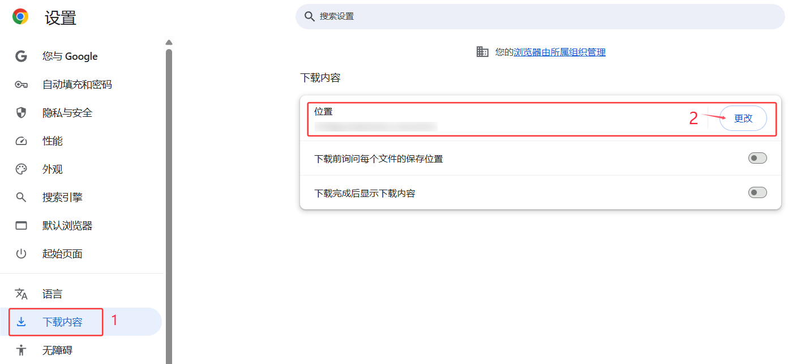

<div align="center">
  <h1>
    
    Crazy Screenshot 📸✨
  </h1>

  <p>
    <a href="#功能特点"></a>
    <a href="LICENSE"></a>
    <a href="#安装方法"></a>
  </p>
</div>

<div align="center">
  <h3>
    <a href="#功能特点">✨ 功能特点</a>
    <span> | </span>
    <a href="#安装方法">📥 安装方法</a>
    <span> | </span>
    <a href="#使用说明">📖 使用说明</a>
    <span> | </span>
    <a href="#项目结构">🏗️ 项目结构</a>
    <span> | </span>
    <a href="#常见问题">❓ 常见问题</a>
  </h3>
</div>

<div align="center">
  <h4>
    <a href="README.md">🇨🇳 中文</a>
    <span> | </span>
    <a href="README_EN.md">🇬🇧 English</a>
  </h4>
</div>

---

## 🌟 简介

Crazy Screenshot 是一个强大的 Google Chrome 浏览器扩展程序，为用户提供智能自动截图功能。当用户开启录制模式后，每次点击鼠标或使用快捷键都会自动触发截屏，将当前浏览器窗口内容保存到本地目录中。

🚀 **完美适用于**：
- 网页训练数据采集
- 操作流程记录
- 教程创建
- 用户体验测试

只需打开插件的录制功能，正常使用浏览器就可以轻松收集数据。如果浏览器使用频繁，一周就可以收集几千张截图，而且几乎无感知干扰！

## 🎬 功能演示

<div align="center">
  <video src="./assets/crazy_screenshot_demo.mp4" data-canonical-src="./assets/crazy_screenshot_demo.mp4" controls="controls" muted="muted" class="d-block rounded-bottom-2 border-top width-fit" style="max-height:640px; min-height: 200px"></video>
</div>

## 📊 开发状态

> 状态标记: ✅ 已完成 | 🔄 正在进行 | ⏳ 计划中

- **🛠️ 功能实现**
  - [x] 监听用户鼠标点击事件，自动触发截屏操作 ✅ 
  - [x] 提供开始/停止录制功能，用户可随时控制截图过程 ✅ 
  - [x] 显示当前会话已截取的图片数量 ✅ 
  - [x] 支持截图延迟设置，可延迟数秒后截图 ✅
  - [x] 支持双击模式，防止误触 ✅
  - [x] 优化文件命名，标签名限制字符数，去除非法字符和emoji ✅
  - [x] 支持全局快捷键截图（默认Ctrl+Shift+Q），通过manifest.json定义 ✅
  - [ ] 支持截图轨迹录制 ⏳
  
- **🐛 问题修复**
  - [x] 修复文件命名处理不当的问题 ✅
  - [x] 修复特殊字符和emoji导致的文件名问题 ✅

## ✨ 功能特点

1. **📸 自动截屏**：监听用户鼠标点击事件，自动触发截屏操作
2. **⏱️ 延迟截图**：可设置点击后延迟数秒再截图，方便捕捉悬浮效果
3. **⌨️ 全局快捷键**：支持使用全局快捷键（默认Ctrl+Shift+Q）直接触发截图，无需点击鼠标
4. **👆 双击模式**：支持双击触发截图，进一步防止误触
5. **📝 智能命名**：截图自动以"当前标签页名称+时间戳"方式命名，限制标签名长度且去除非法字符
6. **🎮 录制控制**：提供开始/停止录制功能，用户可随时控制截图过程
7. **💫 视觉反馈**：截图时提供视觉反馈，让用户知道截图已完成
8. **🔢 计数统计**：显示当前会话已截取的图片数量
9. **🔄 重置功能**：一键还原截图设置
10. **🛡️ 防重复触发**：设置最小截图间隔，防止频繁点击导致的重复截图

## 📥 安装方法

### 🌐 从Chrome网上应用店安装

1. 目前尚未上架Chrome网上应用店 😐 (即将推出)

### 👨‍💻 开发者模式安装

1. 点击右上角的 **Code** 按钮，选择 **Download ZIP** 下载源代码
2. 解压下载的ZIP文件到本地文件夹
3. 打开Chrome浏览器，在地址栏输入 `chrome://extensions/`
4. 在右上角启用"开发者模式"
   
5. 点击"加载已解压的扩展程序"按钮
6. 选择解压后的项目文件夹
7. 扩展程序将被添加到Chrome浏览器中

## 📖 使用说明

### 🚀 基本使用流程

1. **📁 修改默认保存目录**：
   1. 点击Chrome工具栏中的`设置`图标
   2. 选择`下载内容`
   3. 点击`更改`之后选择保存的路径
   
   - 确认设置

2. **▶️ 开始录制**：
   - 点击扩展图标打开控制面板
   - 点击"Start"按钮开始录制
   - 此时每次点击鼠标或使用快捷键(Ctrl+Shift+Q)都会自动截取当前页面
   
3. **⏹️ 停止录制**：
   - 再次点击"Stop"按钮停止录制
   - 重新录制之后会重新记数

### ⚙️ 功能设置

- **⏱️ Delay**：设置点击后延迟多少秒截图，默认为0秒
- **⌨️ Hotkeys**：显示当前快捷键设置，默认为Ctrl+Shift+Q
- **👆 Double Click**：启用双击模式，防止误触
- **🔄 Reset**：一键重置所有设置

### ⚠️ 注意事项

- 请确保设置的保存目录已存在且有写入权限
- 在Windows系统上，如果截图未保存到指定位置，请检查浏览器的默认下载文件夹
- 为避免过多截图，系统设置了最小截图间隔（500毫秒）
- 在隐私敏感页面（如银行网站）上，扩展可能无法正常工作
- 长时间运行可能会占用较多内存，建议定期重启浏览器

## 🏗️ 项目结构

```
Crazy_Screenshot/
├── manifest.json        # 扩展程序配置文件，定义权限、脚本和资源
├── background.js        # 后台脚本，负责截图捕获和保存功能
├── content.js           # 内容脚本，注入网页监听点击事件
├── popup.html           # 弹出窗口HTML结构
├── popup.js             # 弹出窗口交互逻辑
├── popup.css            # 弹出窗口样式
├── styles.css           # 全局样式
├── images/              # 扩展图标资源
│   ├── icon16.png       # 16x16像素图标
│   ├── icon48.png       # 48x48像素图标
│   └── icon128.png      # 128x128像素图标
├── icons/               # 图标生成脚本
│   └── createIcons.js   # 用于生成不同尺寸图标的脚本
├── access/              # 设计资源和原始素材
│   ├── icon.psd         # 图标Photoshop源文件
│   ├── blueprint.pptx   # 扩展设计蓝图
│   ├── start.png        # 开始按钮图标源文件
│   ├── stop.png         # 停止按钮图标源文件
│   └── icon*.png        # 各尺寸图标备份
├── LICENSE              # MIT许可证文件
├── .gitignore           # Git忽略配置文件
└── README.md            # 项目说明文档
```

### 📄 文件说明

1. **🔧 核心功能文件**
   - `manifest.json`: 扩展的配置文件，定义了扩展的名称、版本、权限和资源引用
   - `background.js`: 后台服务脚本，实现截图捕获、保存和管理录制状态的核心逻辑
   - `content.js`: 内容脚本，注入到网页中监听用户点击事件并与后台脚本通信
   - `popup.html`: 扩展弹出窗口的HTML结构，提供用户界面
   - `popup.js`: 弹出窗口的交互逻辑，处理用户输入和状态显示

2. **🎨 样式文件**
   - `popup.css`: 弹出窗口的样式定义，控制界面外观
   - `styles.css`: 全局样式定义，用于通用样式设置

3. **🖼️ 资源文件**
   - `images/`: 包含扩展在Chrome浏览器中显示的各种尺寸图标
   - `icons/createIcons.js`: 用于生成不同尺寸图标的脚本工具
   - `access/`: 包含设计资源和原始素材，如PSD源文件和设计蓝图

4. **📚 项目文档**
   - `README.md`: 项目说明文档，提供安装和使用指南
   - `README_EN.md`: 英文版项目说明文档
   - `LICENSE`: MIT许可证文件，说明项目的开源许可条款

## 🔧 技术实现

Crazy Screenshot采用标准的Chrome扩展架构实现，主要包含以下组件：

### 🧩 核心组件

1. **🔙 后台脚本 (background.js)**：
   - 负责截图捕获和保存
   - 管理录制状态
   - 处理下载文件名和路径
   - 与内容脚本通信

2. **📄 内容脚本 (content.js)**：
   - 注入到网页中监听用户点击事件
   - 发送点击事件到后台脚本
   - 提供视觉反馈
   - 处理Google页面的特殊情况

3. **🖼️ 弹出窗口 (popup.html/js)**：
   - 提供用户界面控制
   - 显示当前状态和统计信息
   - 设置保存目录
   - 开始/停止录制控制

### 🔐 权限说明

扩展需要以下权限才能正常工作：

- `activeTab`：访问当前活动标签页
- `downloads`：管理下载操作
- `storage`：存储用户设置和状态
- `tabs`：获取标签页信息
- `scripting`：注入和执行脚本
- `notifications`：显示通知
- `host_permissions`：访问所有网站

## ❓ 常见问题

1. **❌ 截图未保存到指定位置**
   - 检查指定目录是否存在且有写入权限
   - 查看浏览器的默认下载文件夹（通常在 `chrome://settings/downloads` 中设置）
   - 确认是否有其他程序阻止写入
   - Windows系统用户可能需要使用反斜杠（`\`）而非正斜杠（`/`）

2. **🔧 扩展无法正常工作**
   - 确保Chrome浏览器已更新到最新版本
   - 尝试重新安装扩展
   - 检查控制台是否有错误信息（右键点击扩展图标 > 检查 > 控制台）
   - 确认扩展是否有足够的权限（可能需要重新授权）

3. **🖼️ 截图质量问题**
   - 截图质量取决于当前显示器分辨率和浏览器窗口大小
   - 对于高分辨率显示器，可能需要调整浏览器缩放比例
   - 检查浏览器是否启用了硬件加速

4. **💾 内存占用过高**
   - 长时间运行可能导致内存占用增加
   - 建议定期停止录制并重启扩展
   - 避免在多个标签页同时启用录制功能

## 🔒 隐私声明

Crazy Screenshot尊重用户隐私，不会收集或上传任何用户数据。所有截图都保存在用户指定的本地目录中，不会发送到任何远程服务器。扩展不会：

- 收集用户的浏览历史
- 读取或存储网页上的表单数据
- 跟踪用户的点击行为（除了用于触发截图）
- 将任何数据发送到第三方服务器

## 🤝 贡献指南

欢迎对Crazy Screenshot进行改进和贡献。如果您有任何建议或发现了bug，请在GitHub仓库中提交issue或pull request。

### 🛠️ 如何贡献

1. Fork 本仓库
2. 创建您的特性分支 (`git checkout -b feature/AmazingFeature`)
3. 提交您的更改 (`git commit -m 'Add some AmazingFeature'`)
4. 推送到分支 (`git push origin feature/AmazingFeature`)
5. 打开一个 Pull Request

### 💻 开发环境设置

1. 克隆仓库到本地
2. 在Chrome中加载解压的扩展
3. 修改代码后，在扩展页面点击"重新加载"按钮应用更改

## 📜 许可证

本项目采用MIT许可证。详情请参阅[LICENSE](LICENSE)文件。
