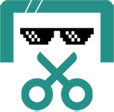

<div align="center">
  <h1>
    
    Crazy Screenshot
  </h1>
  
  <p>
    <a href="#features"></a>
    <a href="LICENSE"></a>
    <a href="#installation"></a>
  </p>
</div>

<div align="center">
  <h3>
    <a href="#features">Features</a>
    <span> | </span>
    <a href="#installation">Installation</a>
    <span> | </span>
    <a href="#usage-instructions">Usage</a>
    <span> | </span>
    <a href="#project-structure">Structure</a>
    <span> | </span>
    <a href="#common-issues">FAQ</a>
  </h3>
</div>

<div align="center">
  <h4>
    <a href="README.md">中文</a>
    <span> | </span>
    <a href="README_EN.md">English</a>
  </h4>
</div>

---

Crazy Screenshot is a Google Chrome browser extension designed to provide automatic screenshot functionality. When users enable recording mode, each mouse click automatically triggers a screenshot, saving the current browser window content to a user-specified local directory. This tool is particularly suitable for collecting web training data, recording operation processes, creating tutorials, or conducting user experience tests.

## Demo

<div align="center">
  <!-- Method 1: Using video tag (may not work on GitHub) -->
  <video width="600" controls>
    <source src="./access/crazy_screenshot_demo.mp4" type="video/mp4">
    Your browser does not support the video tag.
  </video>
  
</div>

## Development Status

> Status markers: ✅ Completed | 🔄 In Progress | ⏳ Planned

- **Feature Implementation**
  - [x] Monitor user mouse click events and automatically trigger screenshots ✅ 
  - [x] Provide start/stop recording functionality for user control ✅ 
  - [x] Display the number of images captured in the current session ✅ 
  - [ ] Provide visual feedback when taking screenshots 🔄
  - [ ] Support keyboard shortcuts to control recording start/stop ⏳
  - [ ] Support screenshot area selection ⏳
  
- **Bug Fixes**
  - [ ] Windows systems cannot save screenshots to specified directory 🔄
  - [ ] Screenshots fail on certain websites ⏳
  - [ ] Optimize memory usage to reduce memory consumption during long-term operation ⏳

## Features

1. **Automatic Screenshots**: Monitors user mouse click events and automatically triggers screenshots
2. **Custom Storage Path**: Allows users to set the local directory for saving screenshots
3. **Smart Naming**: Screenshots are automatically named using "current tab name + timestamp" for easy organization and retrieval
4. **Recording Control**: Provides start/stop recording functionality, allowing users to control the screenshot process at any time
5. **Visual Feedback**: Provides visual feedback when taking screenshots, letting users know when a screenshot is completed
6. **Count Statistics**: Displays the number of images captured in the current session
7. **Google Search Optimization**: Special optimization for Google search pages
8. **Anti-Duplicate Triggering**: Sets a minimum screenshot interval to prevent duplicate screenshots from frequent clicks

## Installation

### From Chrome Web Store

1. Not yet available on the Chrome Web Store, stay tuned 😝

### Developer Mode Installation

1. Click the **Code** button in the upper right corner and select **Download ZIP** to download the source code
2. Extract the downloaded ZIP file to a local folder
3. Open Chrome browser and enter `chrome://extensions/` in the address bar
4. Enable "Developer mode" in the upper right corner
5. Click the "Load unpacked" button
6. Select the extracted project folder
7. The extension will be added to your Chrome browser


## Usage Instructions

### Basic Usage Flow

1. **Set Save Directory**:
   - Click the Crazy Screenshot icon in the Chrome toolbar
   - Click the "Set" button in the popup window
   - Enter the complete folder path (ensure the directory exists and has write permissions)
   - Confirm the setting

2. **Start Recording**:
   - Click the "Start" button to begin recording
   - Status will change to "Recording..."
   - Each mouse click will automatically capture the current page

3. **Stop Recording**:
   - Click the "Stop" button again to stop recording
   - Status will return to "Ready"

### Path Setting Examples

- **Windows**: `C:\Users\Username\Pictures\Screenshots`
- **Mac**: `/Users/username/Pictures/Screenshots`
- **Linux**: `/home/username/Pictures/Screenshots`

### Notes

- Ensure the save directory exists and has write permissions
- On Windows systems, if screenshots are not saved to the specified location, check the browser's default download folder
- To avoid too many screenshots, the system has set a minimum screenshot interval (500 milliseconds)
- The extension may not work properly on privacy-sensitive pages (such as banking websites)
- Long-term operation may consume significant memory; it is recommended to restart the browser periodically

## Project Structure

```
Crazy_Screenshot/
├── manifest.json        # Extension configuration file defining permissions, scripts, and resources
├── background.js        # Background script for screenshot capture and saving
├── content.js           # Content script injected into webpages to monitor click events
├── popup.html           # Popup window HTML structure
├── popup.js             # Popup window interaction logic
├── popup.css            # Popup window styles
├── styles.css           # Global styles
├── images/              # Extension icon resources
│   ├── icon16.png       # 16x16 pixel icon
│   ├── icon48.png       # 48x48 pixel icon
│   └── icon128.png      # 128x128 pixel icon
├── icons/               # Icon generation scripts
│   └── createIcons.js   # Script for generating different sized icons
├── access/              # Design resources and original materials
│   ├── icon.psd         # Icon Photoshop source file
│   ├── blueprint.pptx   # Extension design blueprint
│   ├── start.png        # Start button icon source file
│   ├── stop.png         # Stop button icon source file
│   └── icon*.png        # Various sized icon backups
├── LICENSE              # MIT license file
├── .gitignore           # Git ignore configuration file
├── README.md            # Chinese documentation
└── README_EN.md         # English documentation
```

### File Descriptions

1. **Core Functionality Files**
   - `manifest.json`: Configuration file defining the extension's name, version, permissions, and resource references
   - `background.js`: Background service script implementing core logic for screenshot capture, saving, and recording state management
   - `content.js`: Content script injected into webpages to monitor user click events and communicate with the background script
   - `popup.html`: HTML structure for the extension popup window, providing the user interface
   - `popup.js`: Popup window interaction logic, handling user input and status display

2. **Style Files**
   - `popup.css`: Popup window style definitions controlling the interface appearance
   - `styles.css`: Global style definitions for common style settings

3. **Resource Files**
   - `images/`: Contains various sized icons displayed in the Chrome browser
   - `icons/createIcons.js`: Script tool for generating different sized icons
   - `access/`: Contains design resources and original materials such as PSD source files and design blueprints

4. **Project Documentation**
   - `README.md`: Chinese documentation providing installation and usage guides
   - `README_EN.md`: English documentation
   - `LICENSE`: MIT license file explaining the open source license terms

## Technical Implementation

Crazy Screenshot is implemented using the standard Chrome extension architecture, mainly consisting of the following components:

### Core Components

1. **Background Script (background.js)**:
   - Responsible for screenshot capture and saving
   - Manages recording state
   - Handles download filenames and paths
   - Communicates with content scripts

2. **Content Script (content.js)**:
   - Injected into webpages to monitor user click events
   - Sends click events to the background script
   - Provides visual feedback
   - Handles special cases for Google pages

3. **Popup Window (popup.html/js)**:
   - Provides user interface controls
   - Displays current status and statistics
   - Sets save directory
   - Controls start/stop recording

### Permission Explanation

The extension requires the following permissions to function properly:

- `activeTab`: Access the current active tab
- `downloads`: Manage download operations
- `storage`: Store user settings and state
- `tabs`: Get tab information
- `scripting`: Inject and execute scripts
- `notifications`: Display notifications
- `host_permissions`: Access all websites

## Common Issues

1. **Screenshots Not Saved to Specified Location**
   - Check if the specified directory exists and has write permissions
   - Check the browser's default download folder (usually set in `chrome://settings/downloads`)
   - Confirm if other programs are blocking writes
   - Windows users may need to use backslashes (`\`) instead of forward slashes (`/`)

2. **Extension Not Working Properly**
   - Ensure Chrome browser is updated to the latest version
   - Try reinstalling the extension
   - Check the console for error messages (right-click extension icon > Inspect > Console)
   - Confirm the extension has sufficient permissions (may need to reauthorize)

3. **Screenshot Quality Issues**
   - Screenshot quality depends on current monitor resolution and browser window size
   - For high-resolution displays, you may need to adjust the browser zoom level
   - Check if hardware acceleration is enabled in the browser

4. **High Memory Usage**
   - Long-term operation may cause increased memory usage
   - It is recommended to periodically stop recording and restart the extension
   - Avoid enabling recording on multiple tabs simultaneously

## Privacy Statement

Crazy Screenshot respects user privacy and does not collect or upload any user data. All screenshots are saved in the user-specified local directory and are not sent to any remote servers. The extension does not:

- Collect user browsing history
- Read or store form data on webpages
- Track user click behavior (except for triggering screenshots)
- Send any data to third-party servers

## Contribution Guidelines

Improvements and contributions to Crazy Screenshot are welcome. If you have any suggestions or find bugs, please submit an issue or pull request in the GitHub repository.

### How to Contribute

1. Fork this repository
2. Create your feature branch (`git checkout -b feature/AmazingFeature`)
3. Commit your changes (`git commit -m 'Add some AmazingFeature'`)
4. Push to the branch (`git push origin feature/AmazingFeature`)
5. Open a Pull Request

### Development Environment Setup

1. Clone the repository locally
2. Load the unpacked extension in Chrome
3. After modifying the code, click the "Reload" button on the extensions page to apply changes

## License

This project is licensed under the MIT License. See the [LICENSE](LICENSE) file for details. 